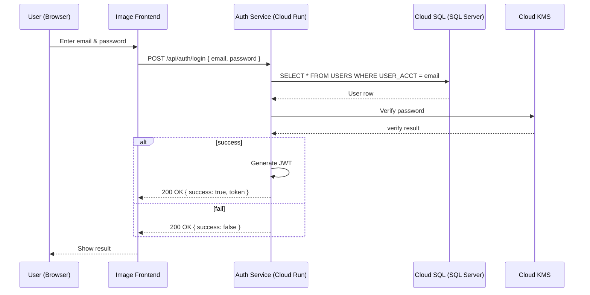

```mermaid
sequenceDiagram
    participant U as User (Browser)
    participant NG as Image Frontend
    participant AUTH as Auth Service (Cloud Run)
    participant DB as Cloud SQL (SQL Server)
    participant KMS as Cloud KMS
    U->>NG: Enter email & password
    NG->>AUTH: POST /api/auth/login { email, password }
    AUTH->>DB: SELECT * FROM USERS WHERE USER_ACCT = email
    DB-->>AUTH: User row
    AUTH->>KMS: Verify password
    KMS-->>AUTH: verify result
    alt success
        AUTH->>AUTH: Generate JWT
        AUTH-->>NG: 200 OK { success: true, token }
    else fail
        AUTH-->>NG: 200 OK { success: false }
    end
    NG-->>U: Show result
```