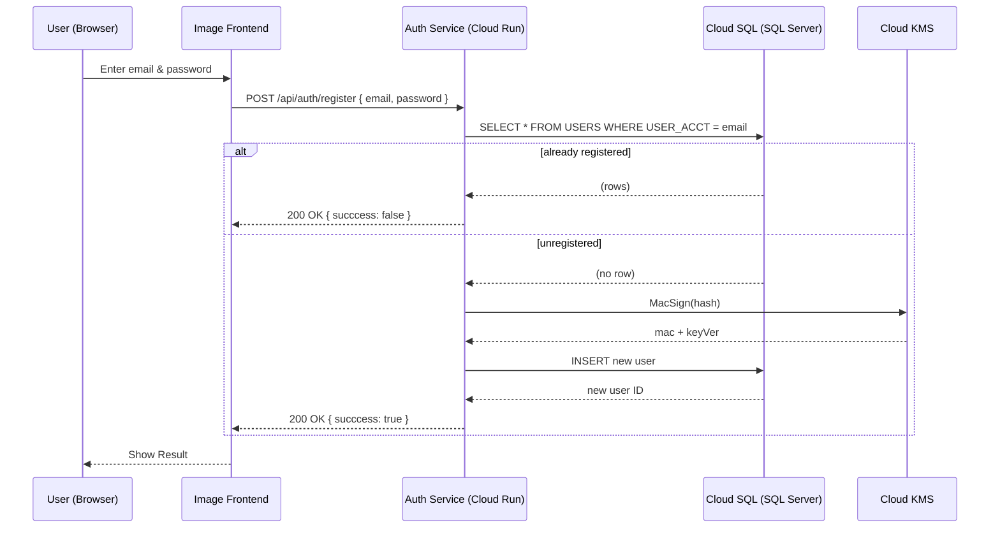

```mermaid
sequenceDiagram
    participant U as User (Browser)
    participant NG as Image Frontend
    participant AUTH as Auth Service (Cloud Run)
    participant DB as Cloud SQL (SQL Server)
    participant KMS as Cloud KMS
    U->>NG: Enter email & password
    NG->>AUTH: POST /api/auth/register { email, password }
    AUTH->>DB: SELECT * FROM USERS WHERE USER_ACCT = email
    alt already registered
    DB-->>AUTH: (rows)
    AUTH-->>NG: 200 OK { succcess: false }
    else unregistered
    DB-->>AUTH: (no row)
    AUTH->>KMS: MacSign(hash)
    KMS-->>AUTH: mac + keyVer
    AUTH->>DB: INSERT new user
    DB-->>AUTH: new user ID
    AUTH-->>NG: 200 OK { succcess: true }
    end
    NG-->>U: Show Result
```